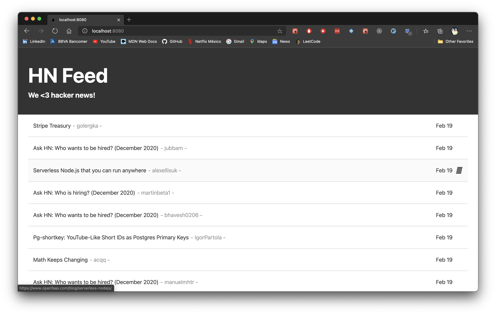

## Full Stack Developer Challenge

[](./ScreenShot_Challenge.png)

------------
> docker-composeThe project is divided into client server, both with their own images to create their containers, these images are built with docker-compose


Running project execute docker-compose
```bash
$docker-compose up --build -d
```

It will create 3 containers, the server, client and MongoDB containers
- Server runs on port 3000
- Client runs on port 8080
- DBName  reign_challenge

When creating the containers for the first time, and filling the database with some data, just modify the `Articles/useCases/article.service.ts` file.

>  @Cron( *  1  *  *  *)  --->  @Cron( *  *  *  *  *)

Wait a minute for the database to fill, and to see the data on the client. After you can leave the previous value.